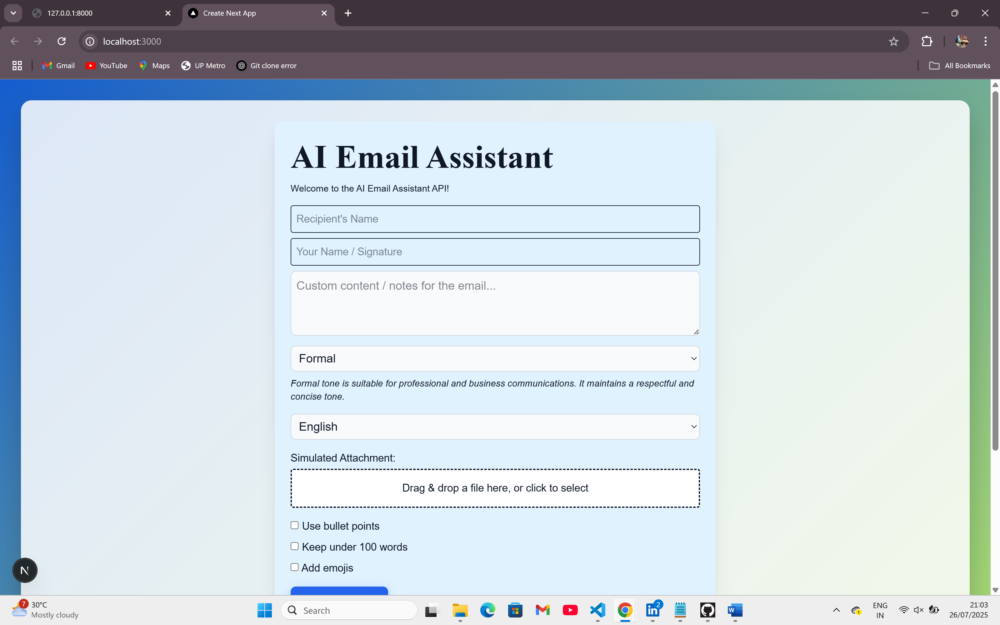
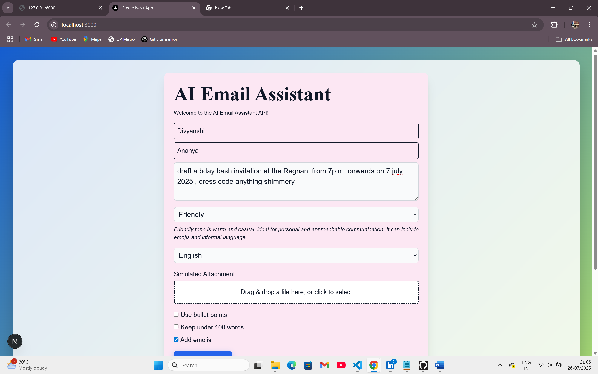
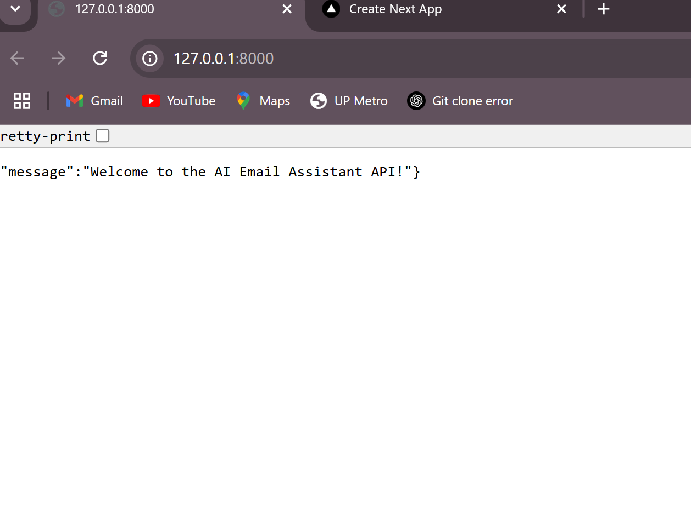

# 💌✨ IntelliMail – AI-Powered Email Assistant

IntelliMail is a smart AI email assistant that generates professional, friendly, persuasive, or custom-tone emails in seconds. Just input your prompt and tone — and let AI craft the perfect message for you!

---

## 🌟 Abstract

In an era of fast communication, IntelliMail streamlines email writing with the power of generative AI. Built using FastAPI and integrated with Google's Gemini API, it helps users draft tone-specific emails instantly. Whether you're writing for business, academics, or personal use, IntelliMail takes care of the wording — so you can focus on your message.

---

## 🚀 Key Features

📨 **Smart Email Generation**: Generate emails from prompts based on your chosen tone (formal, friendly, etc.)  
🤖 **Powered by Gemini AI**: Uses Google’s Gemini API to craft natural, context-aware emails  
🌐 **Full-Stack Integration**: Built with FastAPI and ready to connect to any frontend (Next.js, React, etc.)  
📝 **Editable Output**: Get editable subject and body, separated and styled  
📜 **History Tracking**: MongoDB stores all past email generations for easy access  
🗑️ **Clear History**: One-click deletion of saved drafts/emails  
🌍 **CORS Enabled**: Easily connect with frontend clients or extensions  

---

## 🛠️ Tech Stack

| Layer         | Tech Stack                        |
|---------------|------------------------------------|
| 💻 Backend     | FastAPI, Python                    |
| 🧠 AI Engine   | Google Gemini API                  |
| 🗃️ Database     | MongoDB                            |
| 🔗 API Routing | FastAPI Routers                     |
|🎨 Frontend     | Next.js,TypeScript,Tailwind CSS
| 🔐 Env Mgmt    | python-dotenv                      |

---

## 📸 Screenshots

  
  

  

## ⭐️ Give it a Star!

If you find IntelliMail helpful, please ⭐️ the repo on GitHub! Your support encourages future improvements and new features.
